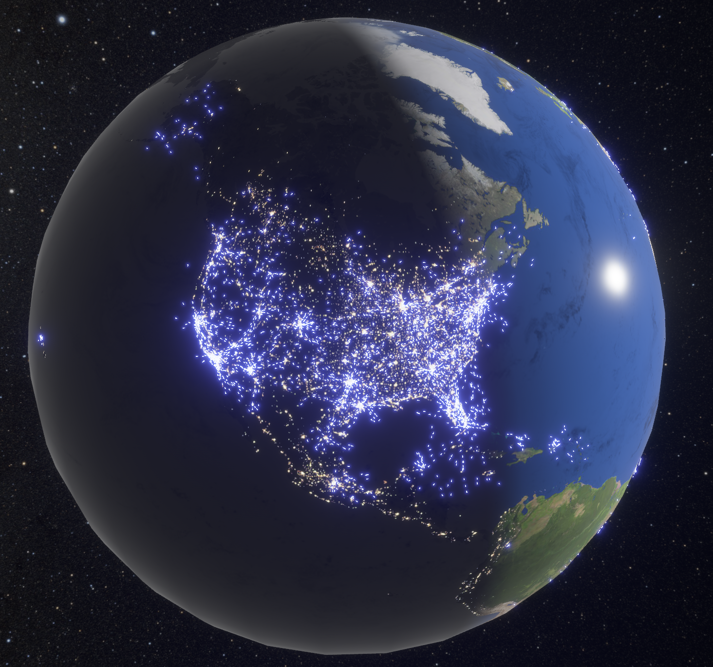

<h1 align="center">
    Bevy Open World
</h1>

  

This repo contains various crates for open world rendering in Bevy.

> [!IMPORTANT]
> Most of these crates are meant as demonstrations of what is possible using Bevy and not so much
> usable as crates that can be used in other projects.
> Therefore, they're not published on crates.io for now.

Currently includes:

- [bevy-adsb](/crates/bevy-adsb/): A plugin to visualize ADS-B aircraft traffic using real-world data from ADSB.lol.
- [bevy-earth](/crates/bevy-earth/): A plugin to render a simple earth model with day/night cycle
- [bevy-flight-sim](/crates/bevy-flight-sim/): A plugin that implements flight simulator elements (instruments etc.)
- [bevy-night-sky](/crates/bevy-night-sky/): A plugin to render a a skybox of our Milky Way sky at night
- [bevy-osm](/crates/bevy-osm/): A plugin for rendering OpenStreetMap buildings, roads etc. in Bevy
- [bevy-skybox](/crates/bevy-skybox/): A plugin to render a simple skybox
- [bevy-svg](/crates/bevy-svg/): A plugin for rendering SVGs, inspired by the `bevy_svg` crate
- [bevy-terrain](/crates/bevy-terrain/): A plugin for rendering quadtree terrain in Bevy

## Resources

See [CREDITS.md](CREDITS.md) for which resources where used.
